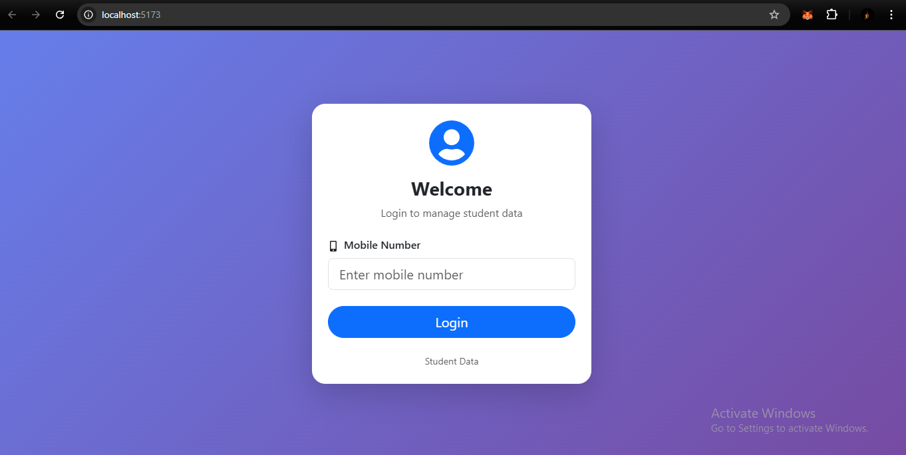
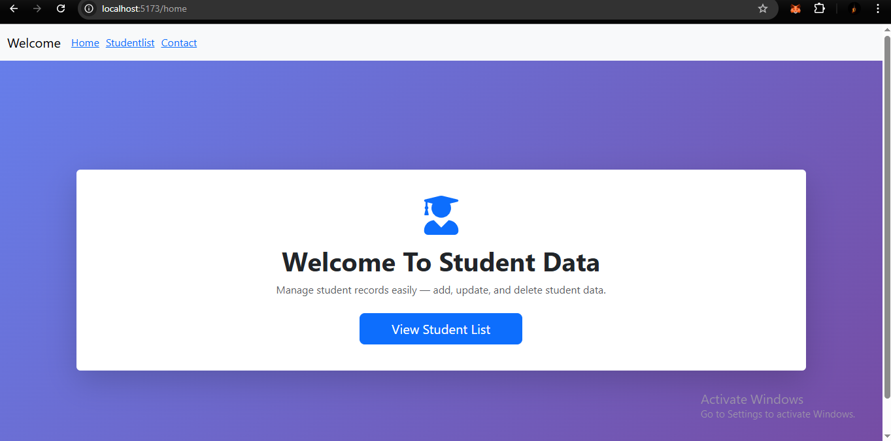
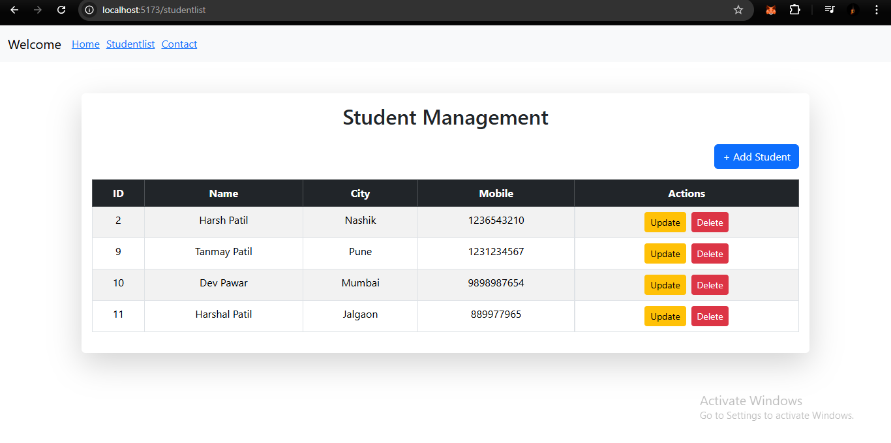
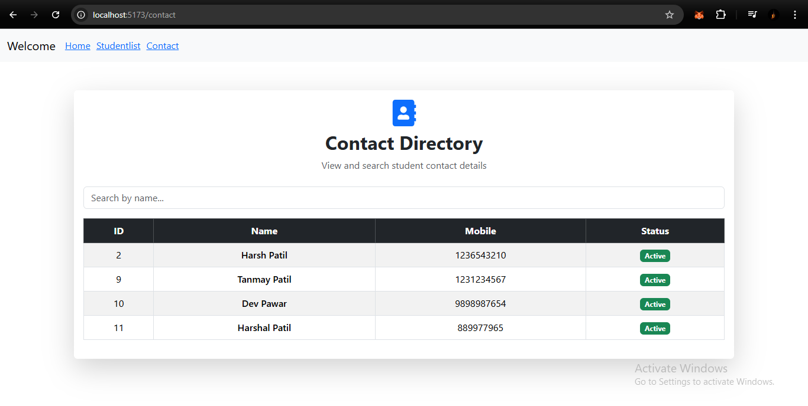

# 🎓 Student Records

A full-stack **Student Data** that allows users to **manage student records** with complete **CRUD operations** using a modern and responsive UI.

---

## 🚀 Features

- 🔐 Simple mobile-number-based login
- 🏠 Modern Home dashboard
- ➕ Add new students
- 📄 View student list
- ✏️ Update student details
- ❌ Delete student records
- 🔍 Search students by name
- 📞 Contact directory (Name & Mobile only)
- 📱 Fully responsive UI

---

## 🛠️ Tech Stack

### Frontend
- ⚛️ React.js
- 🎨 React-Bootstrap
- 🔗 Axios
- 🧭 React Router DOM

### Backend
- ☕ Spring Boot
- 🌐 REST APIs
- 🗄️ PostgreSQL

---






## 📂 Project Structure

src/
│── Home.jsx
│── Userlogin.jsx
│── Studentlist.jsx
│── Contact.jsx
│── App.jsx
│── index.js


---

## 🔄 CRUD Operations

| Operation | Description |
|---------|-------------|
| Create | Add a new student |
| Read | Fetch student list |
| Update | Edit student details |
| Delete | Remove student |

---

## 📸 Screens Included

- Login Page
- Home Dashboard
- Student CRUD Page
- Contact Directory Page

---

## ▶️ How to Run the Project

### Frontend (React)
```bash
npm install
npm run dev
